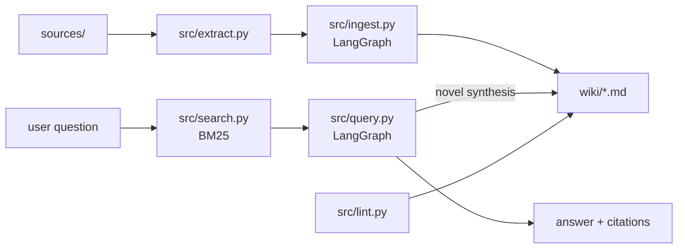

<div align="center">

# LLM Wiki

**Git-backed knowledge base maintained by LLM — Karpathy's LLM Wiki pattern**

[](https://github.com/omnipotence-eth/llm-wiki/actions/workflows/ci.yml)
[](https://www.python.org/)
[](https://langchain-ai.github.io/langgraph/)
[]()
[](https://docs.astral.sh/ruff/)
[](LICENSE)

[Quick Start](#quick-start) | [Architecture](#architecture) | [Commands](#commands) | [How It Works](#how-it-works)

</div>

---

## What Is This

A CLI tool that builds and maintains a persistent knowledge wiki from your source documents. Instead of RAG (re-synthesize every query), the LLM incrementally compiles knowledge into interlinked markdown pages — a compounding artifact that gets smarter with every source you feed it.

Based on [Karpathy's LLM Wiki pattern](https://gist.github.com/karpathy/442a6bf555914893e9891c11519de94f). Obsidian-compatible. Git-versioned. Zero database.

**Three layers:**
1. **Sources** — your PDFs, articles, URLs (immutable, you curate)
2. **Wiki** — LLM-generated markdown pages (concepts, entities, syntheses)
3. **Schema** — `schema.yaml` controls how the LLM creates pages

## Why

LLMs hallucinate. Notes apps don't understand context. This tool bridges the gap — a git-backed knowledge base where an LLM structures your information on ingest and retrieves it intelligently on query. Every page has a validated schema, BM25 search finds what you need, and multi-provider LLM routing (Groq → Gemini → Ollama) means it works whether you have API keys or just a local model. Inspired by Andrej Karpathy's LLM Wiki pattern, built for anyone who wants their personal knowledge base to actually *understand* what's in it.

## Architecture



## Quick Start

```bash
# 1. Use this template on GitHub, then clone
git clone https://github.com/YOUR_USER/my-wiki.git
cd my-wiki

# 2. Install
uv sync

# 3. Configure LLM provider (pick one)
cp .env.example .env
# Edit .env — add Groq or Gemini key (free tier), or use local Ollama

# 4. Ingest a source
wiki ingest papers/my-paper.pdf

# 5. Query your wiki
wiki query "What are the key findings?"

# 6. Check wiki health
wiki lint
```

## Commands

| Command | What It Does |
|---------|-------------|
| `wiki ingest <file>` | Extract text, create 5-15 wiki pages |
| `wiki ingest --url <url>` | Ingest from URL |
| `wiki query "<question>"` | Search wiki, synthesize answer with citations |
| `wiki lint` | Find orphans, broken links, stale pages |
| `wiki stats` | Page count, link density, tag distribution |

## How It Works

### Ingest Pipeline (LangGraph)

```
source file → extract text → chunk → LLM generates pages → write markdown → update index → cross-link
```

The LLM creates structured pages via `instructor` (Pydantic models), ensuring consistent frontmatter, tags, and cross-references.

### Query Pipeline (LangGraph)

```
question → BM25 search → retrieve top pages → LLM synthesizes answer → optionally persist as new page
```

The LLM decides if its synthesis is novel enough to become a permanent wiki page — turning exploration into durable knowledge.

### Wiki Pages

Every page is Obsidian-compatible markdown with YAML frontmatter:

```markdown
---
title: "Transformer Architecture"
type: concept
sources: ["papers/attention.pdf"]
tags: ["deep-learning", "attention"]
confidence: high
---

# Transformer Architecture

The Transformer uses self-attention...

## Related
- [[Self-Attention]]
- [[BERT]]
```

## LLM Providers

Uses LiteLLM — works with any provider. Fallback chain: Groq → Gemini → Ollama.

| Provider | Cost | Setup |
|----------|------|-------|
| Groq | Free (14,400 req/day) | `WIKI_GROQ_API_KEY` |
| Gemini | Free (1,500 req/day) | `WIKI_GEMINI_API_KEY` |
| Ollama | Free (local) | `ollama run qwen2.5:3b` |

## License

MIT
